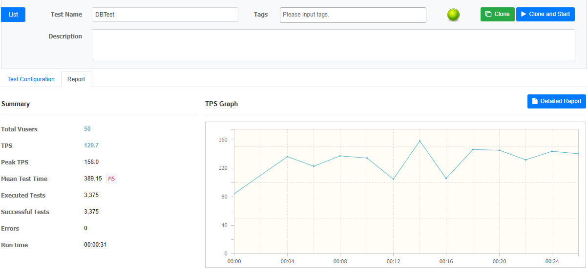
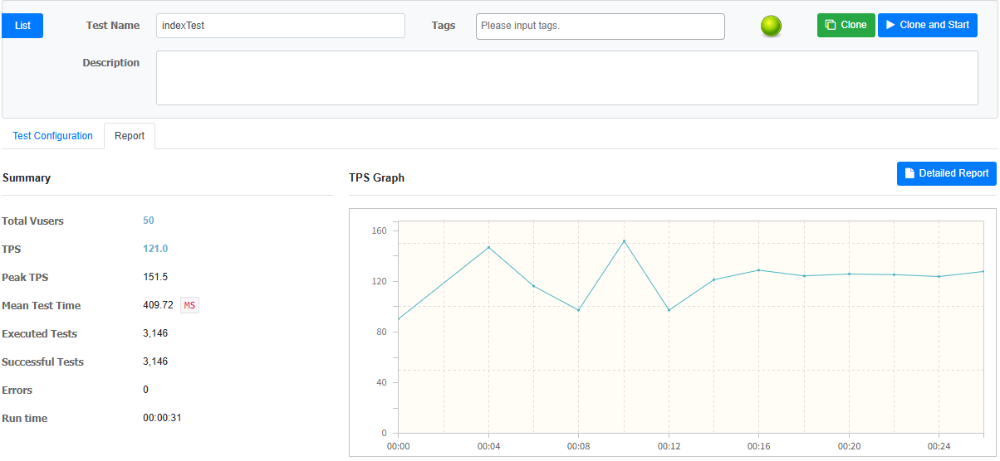
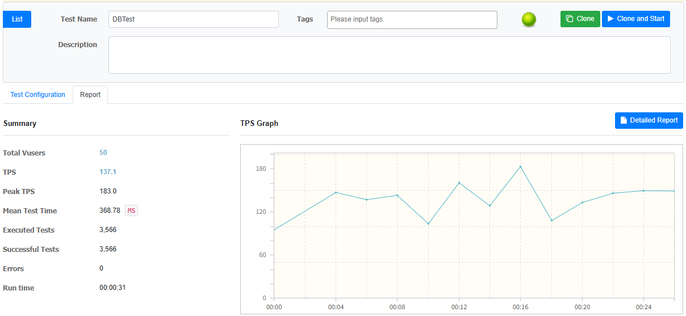
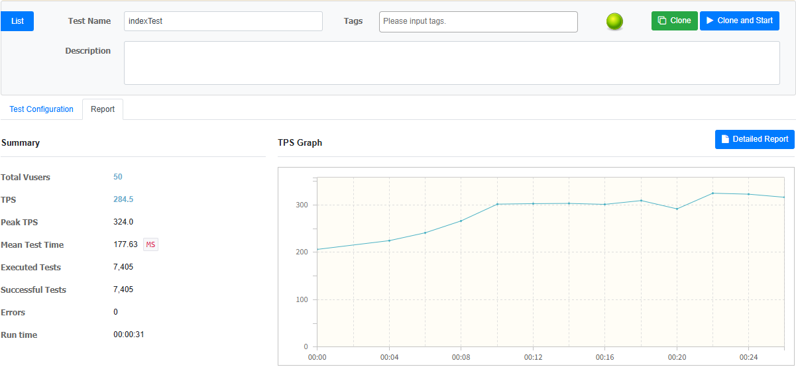

# 인덱스 추가에 대한 조회 성능 테스트

> Products 테이블에 type, price 컬럼에 index 설정
>
> 인덱스가 조회 성능에 미치는 영향을 테스트 해보기 

---
### 테스트 환경
상품 타입 (과일, 음료, 과자) 3개의 타입으로 5만 개의 데이터를 생성

nGrinder 를 통한 상품 목록 조회 테스트 실행

---
## 1. 상품 타입 **과일** 조건으로 상품 목록 조회 실시

### DBTest 결과

### indexTest 결과

TPS 가 **129.7 -> 121.0** 으로 다소 큰 차이는 없지만 **다소 감소** 

---
## 2. 상품 타입 전자기기 조건으로 상품 목록 조회

상품 타입 전자 기기 상품을 4건 추가한 후, 상품 목록 조회

### DBTest 결과

### indexTest 결과

TPS가 **137.1 -> 284.5** 으로 **약 2배의 성능 향상**이 이루어짐

---

## 테스트 결과
- 인덱스는 모든 조회에서 성능 향상을 보장하지는 않음
- 데이터의 인덱스가 특정 데이터를 많이 걸러낼 수 있다면 효과적으로 데이터 조회에 도움을 줄 수 있다.
- 인덱스를 고려할 때는 데이터가 얼마나 분포되어 있는지도 고려 대상이 되야함 
- 여러 컬럼을 같이 조건 조회하는 경우 단일 인덱스 여러 개가 아니라 복합 인덱스를 고려

